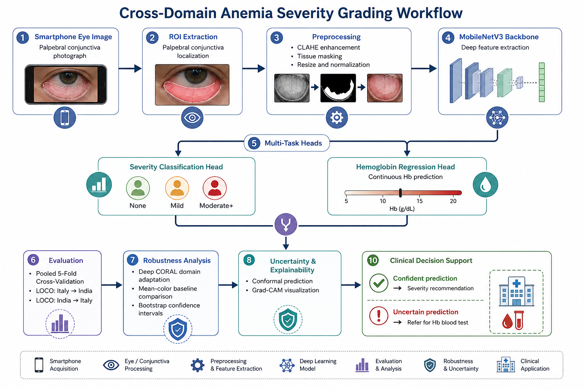
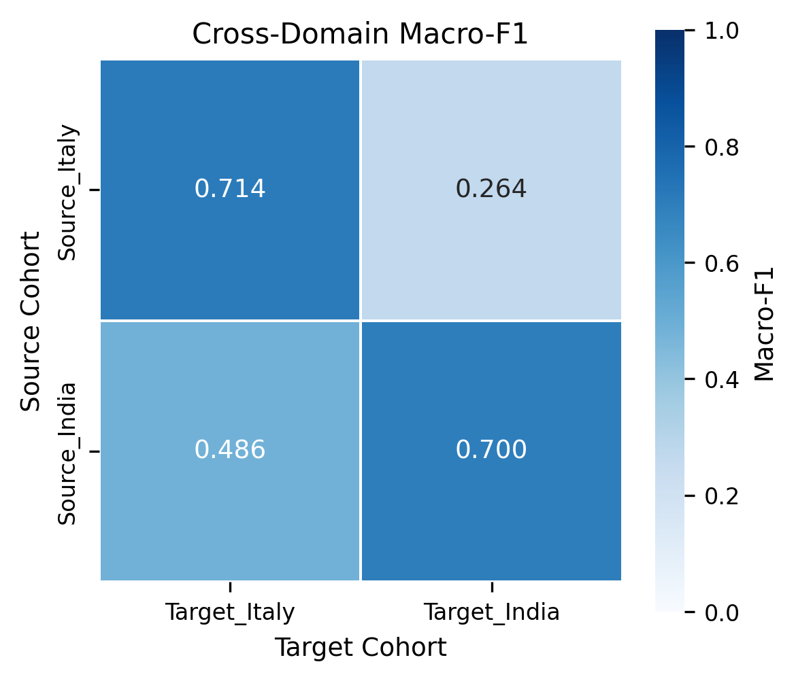
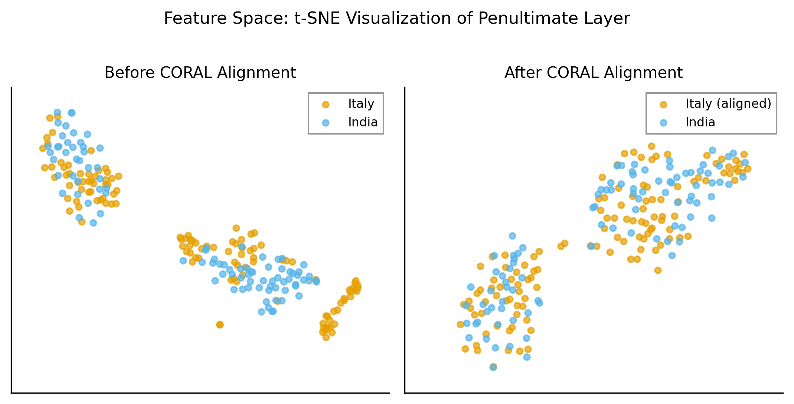
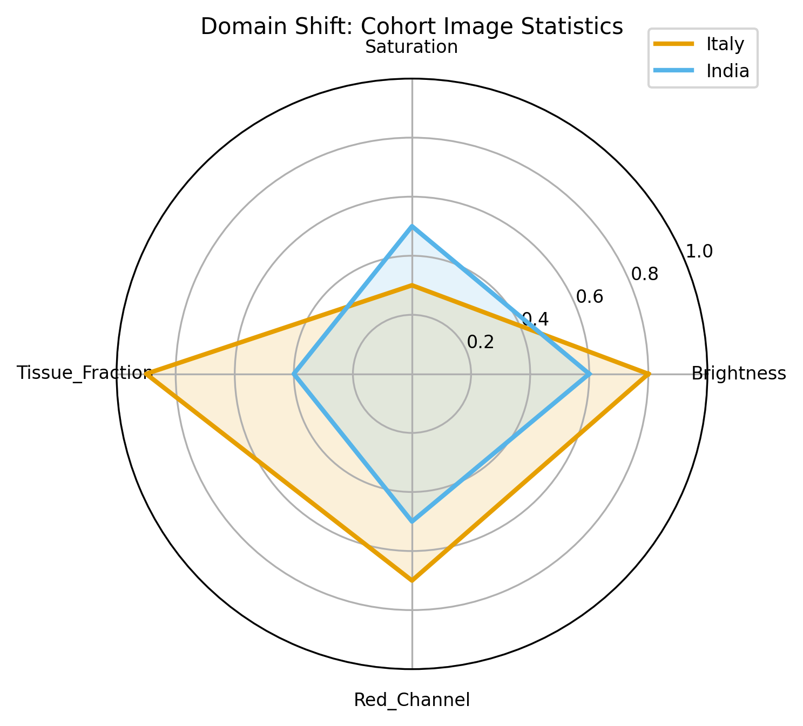
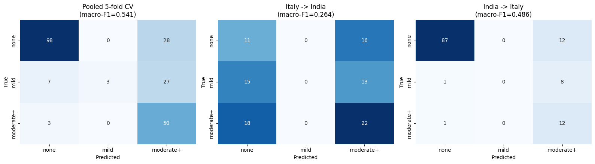
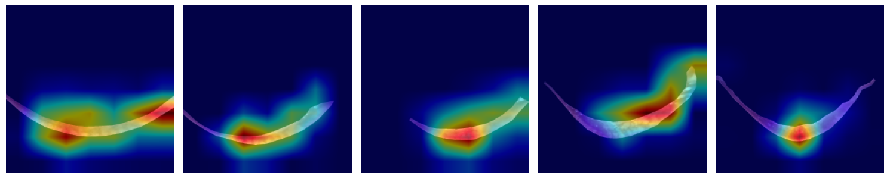

# Cross-Domain Anemia Severity Grading
*Smartphone-Based Palpebral Conjunctiva Anemia Assessment*


## Overview

This repository contains the **code, trained models & supplementary experimental results** for research on **smartphone-based palpebral conjunctiva anemia assessment**.

The repository includes experiments for:

- **3-class anemia severity classification** (`none`, `mild`, `moderate+`)
- **Continuous hemoglobin (Hb) regression**
- **Pooled 5-fold cross-validation**
- **LOCO (Leave-One-Cohort-Out) cross-domain evaluation**
- **Deep CORAL domain adaptation**
- **Tissue masking and preprocessing ablations**
- **Bootstrap confidence intervals**
- **Conformal prediction for uncertainty-aware screening**

The codebase supports training, evaluation, statistical analysis & visualization of cross-domain robustness experiments across heterogeneous clinical cohorts.

## Workflow



The workflow summarizes the complete pipeline from **smartphone eye image acquisition** to **cross-domain evaluation, uncertainty estimation & clinical decision support**.

## Repository Structure

```text
cross-domain-anemia-severity-grading/
├── assets/
│   └── workflow.png
├── models/
│   ├── model_fold0_v4.pt
│   ├── model_fold1_v4.pt
│   ├── model_fold2_v4.pt
│   ├── model_fold3_v4.pt
│   ├── model_fold4_v4.pt
│   ├── model_it2in_FINAL.pt
│   ├── model_in2it_FINAL.pt
│   └── model_it2in_bn_recal.pt
├── notebook/
│   └── anemia_crossdomain.ipynb
├── results/
│   ├── figures/
│   │   ├── confusion_matrix.png
│   │   ├── cross_domain_matrix.png
│   │   ├── feature_alignment.png
│   │   └── radar_chart.png
│   │   └── gradcam_overview.png
│   └── tables/
│       ├── cv_results_3class_v4.csv
│       ├── loco_results_v4.csv
│       ├── bootstrap_ci_macro_f1_v4.csv
│       └── few_shot_calibration_curve.csv
├── requirements.txt
└── README.md
```

## Example Results

The following figures illustrate representative outputs from the final reported experiments.

### Cross-Domain Confusion Matrix



### Feature Alignment (Deep CORAL)



### Model Comparison Radar Chart



### Final Confusion Matrix



### Grad-CAM Visualization




## Requirements

The project dependencies are listed in `requirements.txt`.

```text
torch
torchvision
numpy
pandas
scikit-learn
opencv-python
matplotlib
seaborn
pillow
tqdm
scipy
albumentations
```

## Installation

```bash
git clone https://github.com/mahmudul28/cross-domain-anemia-severity-grading.git
cd cross-domain-anemia-severity-grading

pip install -r requirements.txt
```

## Quick Start

```bash
pip install -r requirements.txt
jupyter notebook notebook/anemia_crossdomain.ipynb
```

For Google Colab, upload `notebook/anemia_crossdomain.ipynb` and mount the dataset directory before execution.

The notebook contains the complete experimental pipeline, including preprocessing, training, cross-validation, LOCO evaluation, domain adaptation, uncertainty estimation & result visualization.

## Computational Environment

Experiments were conducted using:

- Python 3.x
- PyTorch
- Google Colab GPU environment (when applicable)
- CUDA-enabled GPU acceleration

## Dataset

The original patient images are **not included** in this repository.

Experiments were conducted using publicly available palpebral conjunctiva datasets. After obtaining the datasets, configure the dataset path in the notebook before execution.

Dataset access and usage should follow the original dataset licenses and terms.

## Evaluation Protocols

The methodology employs several evaluation schemes to assess model performance and cross-domain generalizability:

*   **Pooled 5-Fold Cross-Validation:** Assesses general performance on the combined multi-center dataset.
*   **LOCO (Leave-One-Cohort-Out) Cross-Domain Evaluation:** Tests model robustness when trained on one geographic/clinical cohort and evaluated on an unseen cohort.
*   **Deep CORAL Domain Adaptation:** Evaluates deep feature alignment using CORAL-based domain adaptation strategies.
*   **Conformal Prediction:** Provides uncertainty-aware screening by generating statistically valid prediction sets rather than point estimates.
*   **Statistical Validation:** Utilizes bootstrap confidence intervals to validate the statistical significance of the macro F1 scores and other classification metrics.

## Result Files

The `results/tables/` directory contains quantitative data from the experimental runs.

| File Name | Description |
| :--- | :--- |
| `cv_results_3class_v4.csv` | Output metrics for the 5-fold cross-validation on the 3-class severity task. |
| `loco_results_v4.csv` | Performance metrics for the Leave-One-Cohort-Out experiments (e.g., Italy to India). |
| `bootstrap_ci_macro_f1_v4.csv` | 95% Bootstrap confidence intervals calculated for Macro F1 scores. |
| `few_shot_calibration_curve.csv` | Calibration curve data from the few-shot target-domain adaptation experiment. |

## Methodology Summary

| Component | Implementation Details |
| :--- | :--- |
| **Classification Task** | 3-class severity grading (None, Mild, Moderate+) |
| **Regression Task** | Continuous Hemoglobin (Hb) value prediction |
| **Domain Adaptation** | Deep CORAL (Correlation Alignment), Batch Normalization Recalibration |
| **Uncertainty Quantification**| Conformal prediction for uncertainty-aware screening |
| **Baseline Comparison** | Mean-color baseline extraction |
| **Preprocessing** | Tissue masking experiments |

## License

This project is licensed under the MIT License.